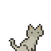
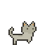
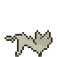
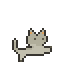
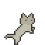
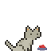
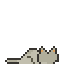
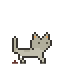

# Byte Buddy
https://github.com/user-attachments/assets/77cd5fd5-f5eb-433b-a4a8-62eced8acada

## Overview
A fully-interactive virtual desktop pet application developed using Python's Tkinter library. The virtual pet walks around the screen, responds to user actions, and interacts with its environment. Users can pick up and drop the pet, feed it, and watch as it playfully interacts with the mouse cursor, creating an engaging and dynamic desktop companion experience.

## Awards
Won **Best Begineer Hack** @ YRHacks 2024

## Actions
 Image                                                | Action        | User Input                       |
|:---------------------------------------------------:|:--------------|:---------------------------------|
|           | Idle          | N/A                              |
|      | Walk          | N/A                              |
|           | Drag & Drop   | Pick up and release with cursor  |
|      | Scratch       | Hold cursor near                 |
|           | Stand         | N/A                              |
|          | Eat           | Right click                      |
|      | Sleep         | N/A                              |
|         | Poop          | N/A                              |

## Credits
- **Design and Developementt**: [Anastasiya006](https://github.com/Anastasiya006), Claire, Vivian
